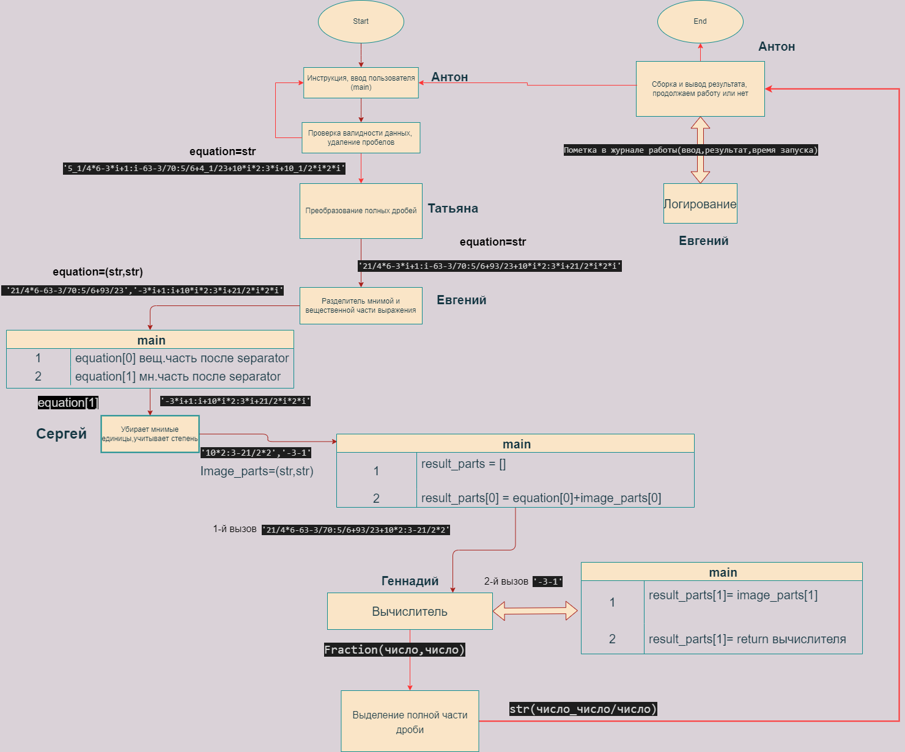

## Задача
Создать калькулятор для работы с рациональными и комплексными числами, организовать меню, добавив в неё систему логирования.
Пример работы:  5_1/4*6+3i+1/i-63-3/70:5/6+4_1/23+10i*2/3i+10_1/2i*2i => a+bi

## Состав команды
- Team lead: Антон Сизых (консультирование, сборка, тестирование). (https://github.com/Evercrow)
- Обработка полных дробей, дизайн UI: Татьяна Никонова (https://github.com/TatyanaNikonova)
- Модуль работы с мнимыми единицами:  Сергей (https://github.com/Serega1067)
- Логгер,сортировка мнимой части: Евгений Скачков (алгоритм, код). https://github.com/FocusNK
- Модуль вычисления, работа с библиотекой Fractions: Геннадий Бут (алгоритм, код) (https://github.com/GennadiyBt)

Общий репозиторий проекта: https://github.com/Evercrow/Study_Projects_Echo/tree/main/calculator

***
## Условия
- Интерфейс будет консольный.
- Считывание идет сразу полным выражением  
    1.Скобки нельзя
    2.Полные и неполные дроби можно(первое число в примере)
    3.Мнимая часть записывается i, а не *i . *i <=> *1i
    4.Операция деления пишется как ":", "/" используется для обозначения дроби
- Логирование -не лог промежуточных операций вычисления , а лог использования пользователями калькулятора

Список нужных модулей:
- Главная функция(main), ввод от пользователя и выход из программы здесь же прописываем(UI) | *Антон*
- Проверка валидности и подчищение входного выражения(пробелы) | *Антон*
- Преобразование полных дробей на входе  ( 5_1/4 => 21/4, строка => строка) | *Татьяна*
- Разбивание выражения на мнимую и вещественную часть (на вход одна строка, на выход две) | *Евгений*
- Удаление мнимой единицы из строкового выражения, с определение знака и вещественности или мнимости члена выражения, по таблице степеней мнимой единицы. | *Сергей* 
- Вычислитель | *Геннадий*
- Преобразование полных дробей на выходе (на вход тип Fraction, выход str) | *Татьяна*
- Логгер : логирование работы калькулятора в файле (пишется входное выражение, результат, временная метка обращения к калькулятору) | *Евгений*
 

Четвертая встреча(обновленная схема третьей встречи):

Вторая встреча:

Первая встреча:
 
 

 